


Web Developer · Creative Builder · Lifelong Learner · Indonesia


I build websites and digital experiences where design meets technology.

I learn by building real things, breaking them, understanding them, and making them better.



Web · Interaction · Immersion · Design · Experimentation


<a href="https://github.com/santidewiayu01/bedtimeStory">
  
</a>

**[Source →](https://github.com/santidewiayu01/bedtimeStory)**

 

<a href="https://minilemon-cafe.vercel.app">
  
</a>

**[Live →](https://minilemon-cafe.vercel.app)** &nbsp;·&nbsp; **[Source →](https://github.com/santidewiayu01/minilemon-cafe)**


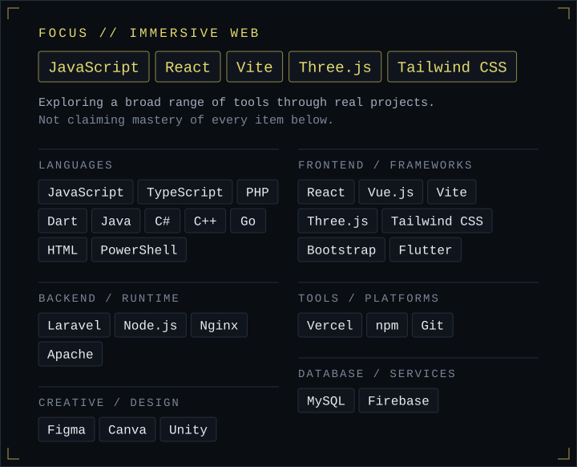

Stack as text

- **Focus for immersive web:** React, Vite, Three.js, JavaScript, Tailwind CSS
- **Languages:** C#, C++, Dart, PHP, JavaScript, Java, HTML, TypeScript, PowerShell, Go
- **Frontend / frameworks:** React, Vue.js, Vite, Three.js, Tailwind CSS, Bootstrap, Flutter
- **Backend / runtime:** Laravel, Node.js, Nginx, Apache
- **Database / services:** MySQL, Firebase
- **Tools / platforms:** Vercel, npm, Git, GitHub, Figma, Canva, Unity

Technologies I work with and explore, not a claim of mastery.


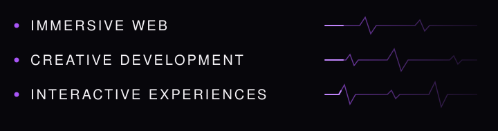


**Exploring:** immersive web · creative frontend · interactive experiences



IDEA → DESIGN → BUILD → BREAK → DEBUG → UNDERSTAND → IMPROVE → SHIP



GitHub activity (live, optional)

  
  


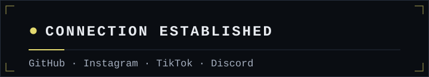

  <a href="https://github.com/santidewiayu01"><b>GitHub</b></a> &nbsp;·&nbsp;
  <a href="https://www.instagram.com/santidewi.ayu.r.a/"><b>Instagram</b></a> &nbsp;·&nbsp;
  <a href="https://www.tiktok.com/@snti.ayu"><b>TikTok</b></a> &nbsp;·&nbsp;
  <a href="https://discord.com/users/1172167266998169694"><b>Discord</b></a>

