<div align="center">


</div>

<br>


I'm **Xun**, a web developer and creative builder from Indonesia.
I enjoy building digital experiences and learning through real projects.
My direction is **immersive and creative web development**.

<br>


```text
$ ls ./what-i-build

  web-applications/
  creative-interfaces/
  interactive-experiences/
  immersive-web/
  responsive-websites/
  experimental-digital-projects/
```

<br>



<details>
<summary>Stack as plain text</summary>

- **Focus (immersive web):** JavaScript, React, Vite, Three.js, Tailwind CSS
- **Languages:** C#, C++, Dart, PHP, JavaScript, Java, HTML, TypeScript, PowerShell, Go
- **Frontend / frameworks:** React, Vue.js, Vite, Three.js, Tailwind CSS, Bootstrap, Flutter
- **Backend / runtime:** Laravel, Node.js, Nginx, Apache
- **Database / services:** MySQL, Firebase
- **Tools / platforms:** Vercel, npm, Git
- **Creative / design:** Figma, Canva, Unity

</details>

<br>


<a href="https://github.com/santidewiayu01/bedtimeStory">
  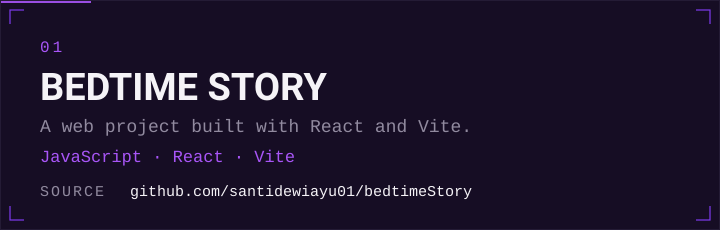
</a>

**[Source](https://github.com/santidewiayu01/bedtimeStory)**

<br>

<a href="https://github.com/santidewiayu01/minilemon-cafe">
  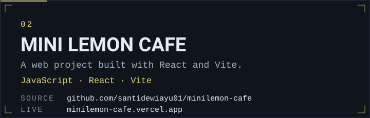
</a>

**[Source](https://github.com/santidewiayu01/minilemon-cafe)** · **[Live](https://minilemon-cafe.vercel.app)**

<br>


```text
> IMMERSIVE WEB
> CREATIVE DEVELOPMENT
> INTERACTIVE EXPERIENCES
```

<br>


Still exploring: the range of tools above, applied to immersive and creative web work, one real project at a time.

<br>


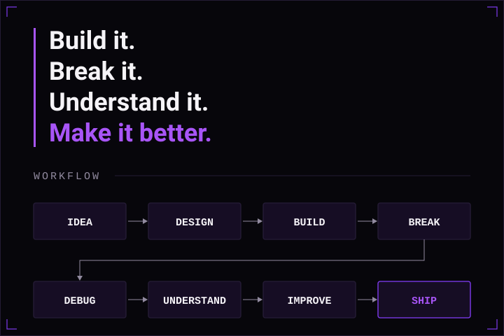

<sub>IDEA → DESIGN → BUILD → BREAK → DEBUG → UNDERSTAND → IMPROVE → SHIP</sub>

<br>


<p align="center">
  
  
</p>

<br>



<br>



<p align="center">
  <a href="https://github.com/santidewiayu01"><b>GitHub</b></a> &nbsp;·&nbsp;
  <a href="https://www.instagram.com/santidewi.ayu.r.a/"><b>Instagram</b></a> &nbsp;·&nbsp;
  <a href="https://www.tiktok.com/@snti.ayu"><b>TikTok</b></a> &nbsp;·&nbsp;
  <a href="https://discord.com/users/1172167266998169694"><b>Discord</b></a>
</p>

<br>

<p align="center">
  <b>Still learning.<br>
  Still building.<br>
  Still becoming.</b>
</p>
